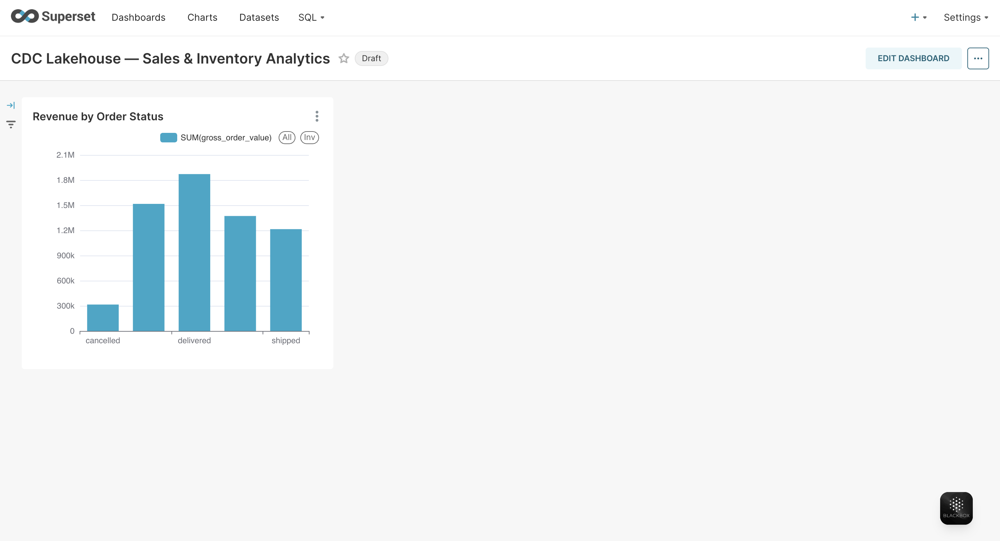
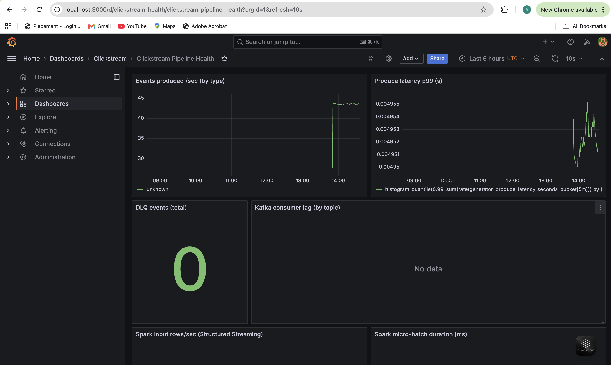
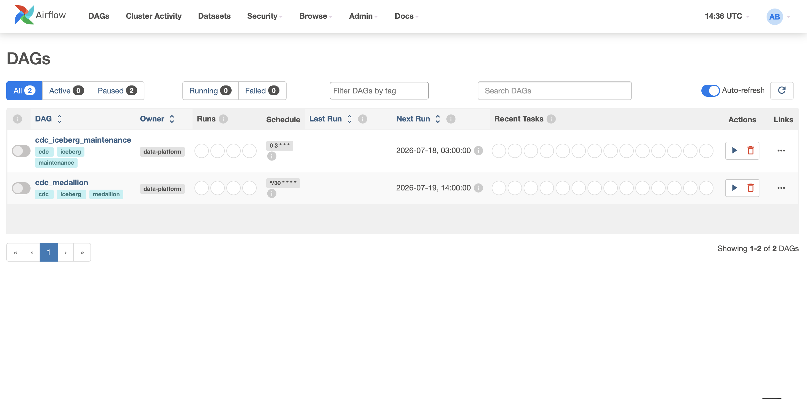
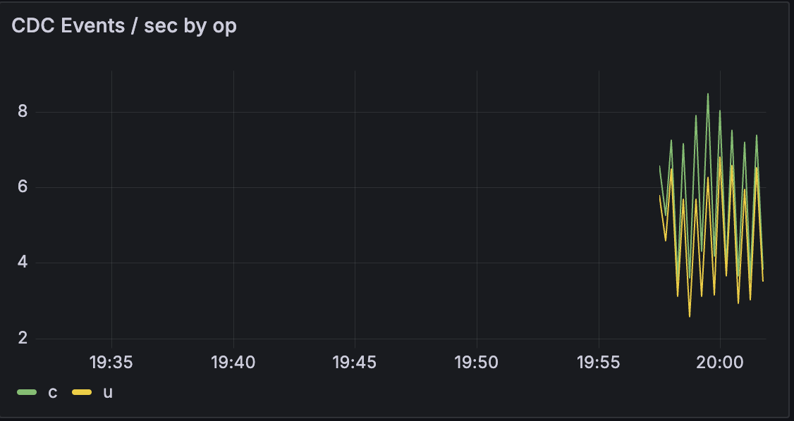

# 🛰️ CDC Lakehouse Platform

**Production-grade Change Data Capture → Streaming Lakehouse → Analytics**

Postgres · Debezium · Kafka · Spark Structured Streaming · Apache Iceberg · Trino · Superset

---

## 1. What this is

A reference implementation of the CDC replication stack used by data-intensive
companies (Netflix, Uber, Airbnb, Stripe, LinkedIn) to move row-level changes
out of OLTP databases into a queryable lakehouse **in near real time, with
exactly-once semantics and full schema evolution**.

Every mutation on the source Postgres — `INSERT`, `UPDATE`, `DELETE` — is
captured from the write-ahead log by Debezium, streamed through Kafka, landed
immutably in a **Bronze** Iceberg table, deduplicated and conformed into
current-state **Silver** tables, and rolled up into business-ready **Gold**
marts that power BI dashboards.

> **This is not a toy.** Clean architecture, SOLID, PEP 8, full type hints,
> config-driven (zero hardcoding), structured logging, Prometheus metrics,
> Great Expectations contracts, complete CI/CD, Docker Compose for local, and
> Kubernetes manifests for production.

## 2. Architecture

\`\`\`
┌──────────┐  WAL   ┌──────────┐  Avro  ┌────────┐ micro-batch ┌──────────────────┐
│ Postgres │───────▶│ Debezium │───────▶│ Kafka  │────────────▶│ Spark Structured │
│  (OLTP)  │ logical│ (Connect)│ +Schema│        │exactly-once │    Streaming     │
└──────────┘ repl.  └──────────┘  Reg.  └────────┘             └────────┬─────────┘
                                                                         │
              ┌──────────────── Medallion (Apache Iceberg) ─────────────▼──────────┐
              │  BRONZE (raw append) → SILVER (dedup/SCD/current) → GOLD (marts)    │
              └───────────────────────────────┬──────────────────────────────────────┘
                                               │ ANSI SQL
                                         ┌─────▼─────┐     ┌───────────┐
                                         │   Trino   │────▶│  Superset │
                                         └───────────┘     └───────────┘

  Orchestration: Airflow · Transforms: dbt · Contracts: Great Expectations
  Observability: Prometheus + Grafana · Ship: Docker Compose / K8s / GitHub Actions
\`\`\`

Rich diagrams (system, CDC flow, sequence, medallion, deployment) live in
[\`docs/diagrams/\`](docs/diagrams/) and render natively on GitHub.

## 3. The data model

Five OLTP tables replicated end-to-end. Full DDL in
[\`infra/postgres/init/01_schema.sql\`](infra/postgres/init/01_schema.sql).

| Table | Grain | Primary key | Notable columns |
|-------|-------|-------------|-----------------|
| \`customers\` | one row per customer | \`customer_id\` | email, tier, country, updated_at |
| \`products\` | one row per SKU | \`product_id\` | category, unit_price, is_active |
| \`inventory\` | one row per (product, warehouse) | \`inventory_id\` | quantity_on_hand, reorder_level |
| \`orders\` | one row per order | \`order_id\` | customer_id (FK), status, order_total |
| \`payments\` | one row per payment attempt | \`payment_id\` | order_id (FK), method, amount, status |

## 4. Medallion layers

| Layer | Iceberg namespace | Semantics | Written by |
|-------|-------------------|-----------|------------|
| **Bronze** | \`lakehouse.bronze.*\` | Immutable append-only log of every CDC event (op, before, after, LSN, ts). | \`streaming/bronze\` |
| **Silver** | \`lakehouse.silver.*\` | Deduplicated, ordered, PK-collapsed current state via Iceberg \`MERGE INTO\`. Deletes tombstoned. | \`streaming/silver\` |
| **Gold** | \`lakehouse.gold.*\` | Conformed business marts. Star-schema facts & dims. | \`dbt\` + \`streaming/gold\` |

### Gold marts exposed

- **Customer Analytics** — \`gold.dim_customer\`, \`gold.customer_360\` (RFM, LTV, tenure).
- **Sales Dashboard** — \`gold.fct_sales\`, \`gold.sales_daily\`.
- **Revenue** — \`gold.revenue_daily\`, \`gold.revenue_by_segment\`.
- **Inventory** — \`gold.inventory_health\` (days-of-cover, stockout risk).
- **Order Metrics** — \`gold.order_funnel\`, \`gold.fulfillment_sla\`.

## 5. Correctness guarantees

| Concern | How it's solved |
|---------|-----------------|
| **INSERT/UPDATE/DELETE** | Debezium \`op\` codes \`c/u/d/r\` decoded in Bronze; deletes carry \`before\` image, tombstoned in Silver. |
| **Schema evolution** | Schema Registry (BACKWARD compat) + Iceberg native add/rename/reorder. |
| **Deduplication** | Window over PK ordered by \`(source_lsn, source_ts_ms)\`; keep latest. Idempotent MERGE. |
| **Primary keys** | Declared per table in [\`configs/tables.yml\`](configs/tables.yml). |
| **Out-of-order events** | Ordering by LSN, not wall-clock; watermarks bound state; MERGE reconciles late data. |
| **Retries** | \`tenacity\` exponential backoff on all external I/O; Connect + Spark task retries. |
| **Checkpointing** | Spark checkpoint per stream on S3; offsets committed atomically with output. |
| **Exactly-once** | Kafka offsets + Iceberg atomic snapshot commit in one micro-batch; idempotent MERGE makes replays safe. |

See [\`docs/DESIGN_DECISIONS.md\`](docs/DESIGN_DECISIONS.md) for the *why*.

## 6. Repository layout

\`\`\`
cdc-lakehouse-platform/
├── docker-compose.yml            # Full local stack
├── Makefile                      # One-word entrypoints
├── pyproject.toml                # Packaging, ruff, mypy, pytest
├── .env.example                  # 12-factor config
├── src/cdc_platform/             # Installable Python package
│   ├── common/                   #   config, logging, metrics, retries, registry
│   ├── ingestion/                #   Debezium connector management
│   ├── streaming/                #   bronze / silver / gold jobs + engine
│   ├── quality/                  #   Great Expectations runner
│   └── generators/               #   seed loader + change simulator
├── infra/                        # Service configs (postgres, debezium, trino, ...)
├── dbt/                          # Gold transformations
├── great_expectations/           # Data contracts
├── airflow/dags/                 # Orchestration
├── k8s/                          # Kustomize base + overlays
├── scripts/                      # register connectors, submit spark, smoke test
├── tests/                        # unit + integration
├── docs/                         # diagrams, ADRs, design, interview Q&A
└── .github/workflows/            # CI, docker, release
\`\`\`

## 7. Quickstart

Requires Docker 24+, Compose v2, ~8 GB RAM free.

\`\`\`bash
git clone https://github.com/your-org/cdc-lakehouse-platform.git
cd cdc-lakehouse-platform
make up                    # boot the full stack
make register-connectors   # arm Debezium against all 5 tables
make seed                  # load a realistic baseline dataset
make bronze                # start Bronze streaming job
make silver                # start Silver streaming job
make simulate              # continuous INSERT/UPDATE/DELETE traffic
make dbt-run               # build Gold marts
make gx                    # run data-quality checkpoints
\`\`\`

| Service | URL | Credentials |
|---------|-----|-------------|
| Superset | http://localhost:8088 | admin / admin |
| Trino | http://localhost:8080 | analytics |
| Airflow | http://localhost:8085 | airflow / airflow |
| Grafana | http://localhost:3000 | admin / admin |
| Kafka Connect | http://localhost:8083 | — |
| MinIO console | http://localhost:9001 | minioadmin / minioadmin |
| Spark master UI | http://localhost:8090 | — |

## 8. Screenshots

> Placeholders — drop real captures into \`docs/images/\`.

| Superset — Sales & Revenue | Grafana — Pipeline Health |
|:--:|:--:|
|  |  |

| Airflow — Medallion DAG | CDC flow latency |
|:--:|:--:|
|  |  |

## 9. Scalability, bottlenecks, tradeoffs, future work

Full treatment in [\`docs/DESIGN_DECISIONS.md\`](docs/DESIGN_DECISIONS.md). Headlines:

- **Scale-out** is horizontal at every hop: partition Kafka by PK hash, add Spark
  executors, async Iceberg compaction, Trino workers scale with query load.
- **Primary bottleneck** is single-slot Postgres logical decoding; mitigated by
  publication filtering, \`pgoutput\`, and (extreme scale) sharded slots.
- **Key tradeoff**: micro-batch latency (seconds) vs. true continuous — chosen for
  Iceberg commit atomicity and operational simplicity.
- **Future**: Flink for sub-second SLAs, Iceberg WAP branching, automated
  backfill/replay tooling, cross-region DR.

## 10. Testing & quality gates

\`\`\`bash
make lint              # ruff + black + mypy (strict)
make test              # unit tests, 80% coverage gate
make test-integration  # end-to-end against compose
make gx                # Great Expectations contracts
\`\`\`

## 11. Interview prep

Module-by-module questions **with answers** in
[\`docs/interview/\`](docs/interview/).

## 12. License

MIT — see [LICENSE](LICENSE).
