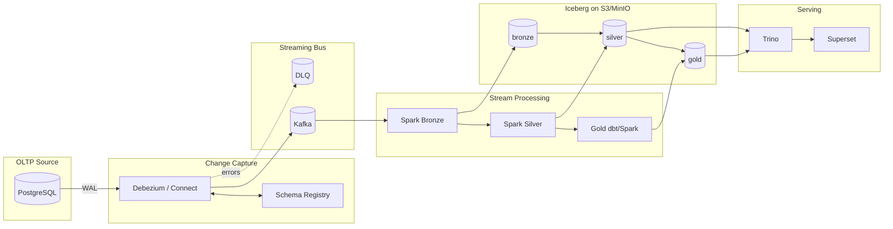
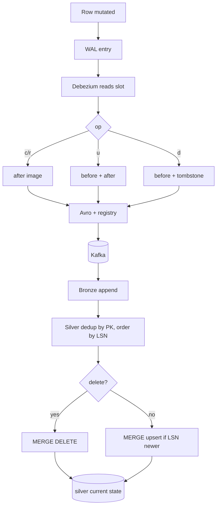
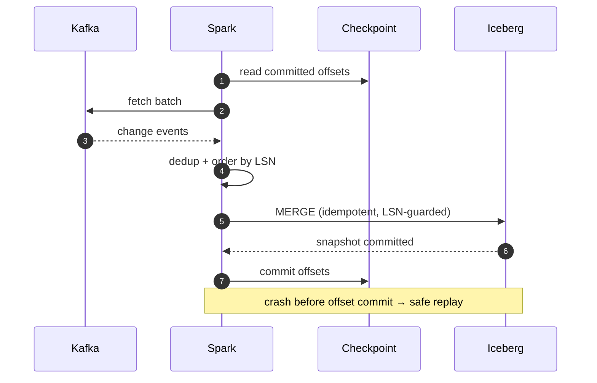
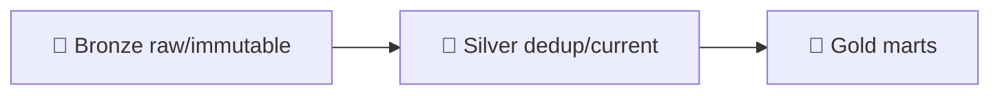

# Architecture

All diagrams below render natively on GitHub (Mermaid). Source files live in
[`docs/diagrams/`](diagrams/).

## System architecture

## CDC flow (INSERT / UPDATE / DELETE)

## Exactly-once sequence

## Medallion

